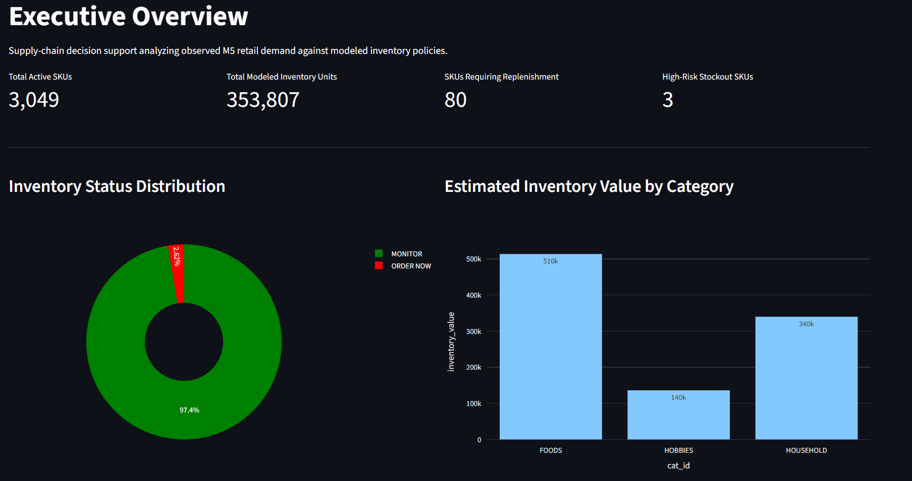
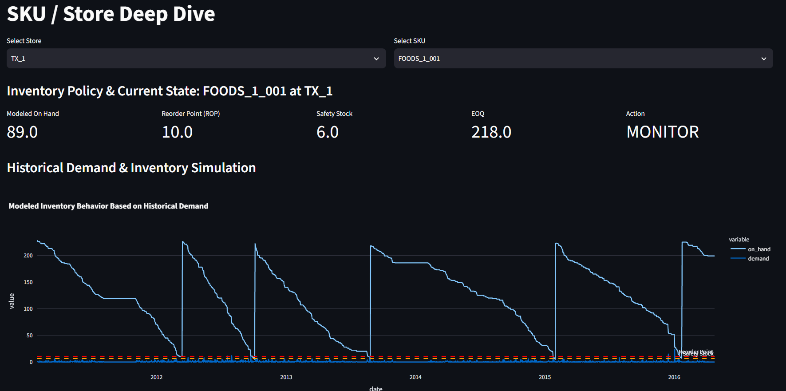
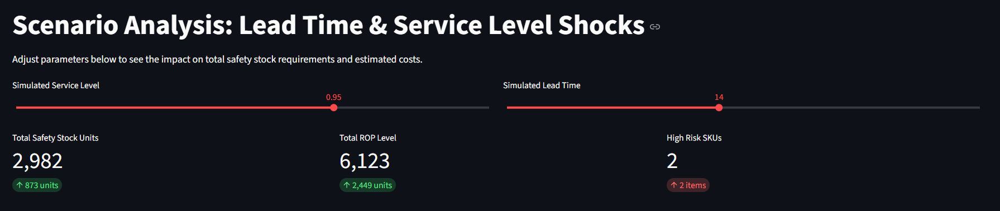

# 📦 Inventory Optimization & Replenishment Engine

**[🔴 View Live Dashboard Here](https://anunnay-inventory-engine.streamlit.app/)**

## 📊 Business Problem
Retailers constantly struggle to balance product availability with holding costs. Ordering too much ties up working capital and risks obsolescence; ordering too little leads to stockouts and lost sales. 

This project is a complete decision-support engine that analyzes real-world retail demand data to optimize replenishment policies. It acts as a functional tool for Supply Chain Analysts and Inventory Planners to dynamically balance cost and risk.

---

## 📸 Application Preview

<div align="center">
  
  <br/>
  <i>Executive Overview analyzing active inventory status and capital allocation.</i>
  <br/><br/>
  
  <br/>
  <i>Deep dive into SKU-level historical demand simulation vs. configured ROP and Safety Stock.</i>
  <br/><br/>
  
  <br/>
  <i>Interactive What-If modeling for service level and lead time impacts.</i>
</div>

---

## 🎯 Key Features & Methodology
* **Observed vs. Derived Data:** Strictly separates real sales metrics from calculated supply chain policies.
* **Economic Order Quantity (EOQ):** Calculates the optimal order size minimizing total costs: $EOQ = \sqrt{\frac{2 \times D \times S}{H}}$
* **Safety Stock & Reorder Point (ROP):** Dynamic buffers calculated using standard deviation of lead-time demand: $ROP = (D_{avg} \times L) + (Z \times \sigma \times \sqrt{L})$
* **Risk Assessment:** Rule-based evaluation classifying SKUs into Stockout Risk categories based on lead time vs. days of supply.
* **Scenario Analysis:** Interactive stress-testing of Service Levels and Lead Times to instantly view capital requirements.

## 🛠️ Tech Stack
* **Language:** Python 3
* **Data Processing:** Pandas, NumPy, SciPy, PyArrow (Parquet for memory optimization)
* **Frontend:** Streamlit, Plotly (Interactive visualizations)

## 📂 Dataset Notes
This project uses the publicly available **[M5 Forecasting Accuracy dataset](https://www.kaggle.com/c/m5-forecasting-accuracy/data)** (Walmart retail sales). 
* *Note 1:* The dataset provides historical demand and selling prices but does not expose operational inventory parameters. Lead time, ordering cost, holding cost, and starting inventory are modeled dynamically.
* *Note 2:* To comply with Streamlit Community Cloud's 1GB memory limit, the ETL pipeline filters the dataset down to a representative store (`TX_1`) and category (`HOBBIES`).

---

## 🚀 How to Run Locally

1. Clone this repository:
   ```bash
   git clone [https://github.com/Anunnay/inventory-optimization.git](https://github.com/Anunnay/inventory-optimization.git)
   cd inventory-optimization
